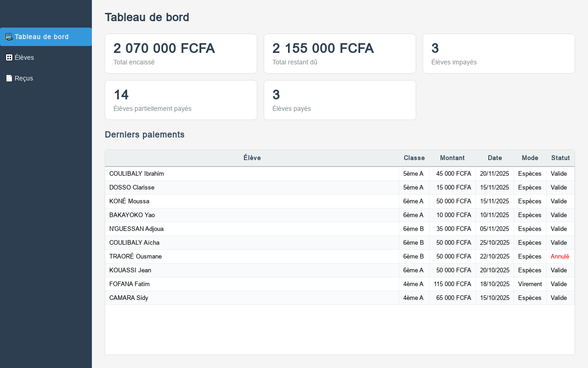
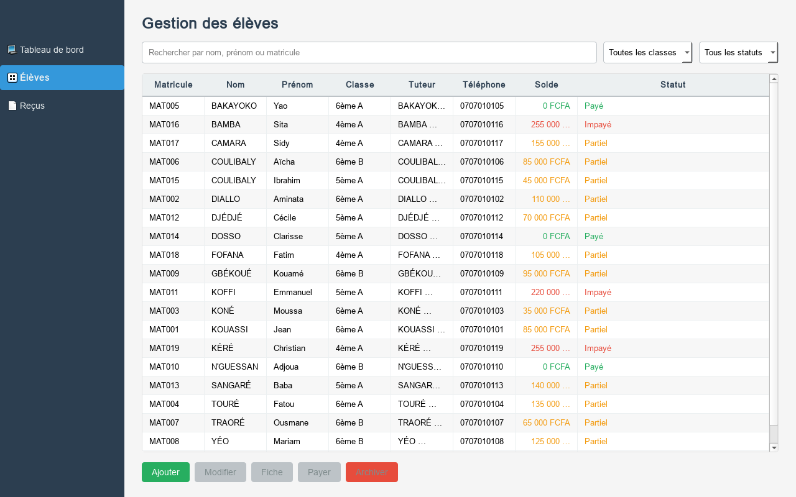
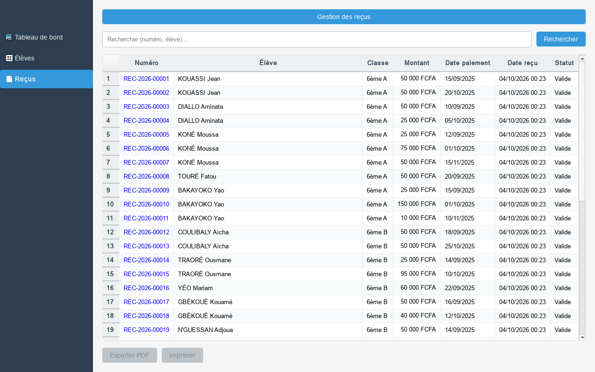

# Gestion Scolarité

Application desktop de gestion des élèves et des frais scolaires.

## Architecture

- **UI** : PySide6 (interface graphique)
- **Services** : Logique métier
- **Repositories** : Accès aux données
- **Database** : SQLite via sqlite3 (stdlib)
- **Reports** : reportlab pour la génération de PDF

## Installation

### Prérequis

- Python 3.10 ou supérieur
- Windows (recommandé), Linux ou macOS

### Installation des dépendances

```bash
pip install -r requirements.txt
```

Les dépendances principales sont :
- PySide6 6.11.2 (interface graphique)
- pytest 8.0.0 (tests)
- pytest-cov 4.1.0 (couverture de tests)
- pytest-qt 4.2.0 (tests UI)
- reportlab 4.2.0 (génération PDF)

## Initialisation de la base de données

### En développement

La base de données est générée automatiquement au premier lancement si elle n'existe pas.

Pour générer manuellement la base de données avec les données de test :

```bash
python -m database.database
```

Cela crée le fichier `school.db` à la racine du projet avec :
- 1 année scolaire (2025-2026)
- 4 classes (6ème A, 6ème B, 5ème A, 4ème A)
- 20 élèves
- 37 paiements (environ 40, couvrant les statuts : impayé, partiel, payé)
- 2 paiements annulés
- Un reçu figé pour chaque paiement, y compris les paiements annulés

### Avec l'exécutable

L'exécutable utilise une base de données stockée dans le dossier utilisateur :
- Windows : `%APPDATA%\GestionScolarite\school.db`
- Linux/macOS : `~/.local/share/GestionScolarite/school.db`

La base de données template est copiée au premier lancement.

## Lancement de l'application

### En développement

```bash
python main.py
```

### Avec l'exécutable

Lancer `GestionScolarite.exe` (après build, voir section Build).

## Tests

### Lancer tous les tests

```bash
pytest
```

### Lancer les tests avec couverture

```bash
pytest --cov=. --cov-report=html
```

Le rapport de couverture sera généré dans `htmlcov/index.html`.

### Tests spécifiques

```bash
# Tests des repositories
pytest tests/test_repositories.py

# Tests des services
pytest tests/test_services.py

# Tests du générateur de PDF
pytest tests/test_recu_generator.py
```

## Écrans de l'application

- **Tableau de bord** : total encaissé, reste à payer, nombre d'élèves par
  statut et derniers paiements.
- **Élèves** : recherche par nom, prénom ou matricule, filtres de classe et de
  statut, solde coloré et actions pour ajouter, modifier, consulter la fiche,
  payer ou archiver un élève.
- **Reçus** : historique consultable/recherchable, export PDF et impression.
  Un reçu demeure visible même si le paiement associé est ensuite annulé.

Les captures ci-dessous ont été produites avec Qt en mode offscreen en appelant
`widget.grab()` :

| Tableau de bord | Élèves | Reçus |
|---|---|---|
|  |  |  |

Pour les régénérer après avoir créé la base d'exemple :

```bash
python -m tests.generate_screenshots
```

## Règles métier

### Année scolaire et frais

- Chaque année scolaire a une date de début et de fin
- Chaque classe a une grille de frais par année (Inscription, Scolarité, Autres)
- Les frais dus d'un élève = somme de la grille de sa classe pour l'année

### Paiements

- Les paiements sont libres (tranches), rattachés à un élève et une année
- Solde = frais dus − somme des paiements NON annulés
- Statut :
  - "Impayé" si rien de payé
  - "Partiel" si 0 < payé < dû
  - "Payé" si solde = 0
- Un paiement ne peut JAMAIS dépasser le solde restant (refus + message clair)
- Modes de paiement : Espèces, Chèque, Virement, Mobile

### Devise et montants

- Devise : FCFA
- Montants stockés en entiers dans la base de données
- Affichage avec séparateur de milliers : "25 000 FCFA"

### Archivage et suppression

- Un élève n'est jamais supprimé : il est archivé (actif = 0)
- Un paiement n'est jamais supprimé : il peut être annulé (statut "annulé" avec motif)
- L'annulation d'un paiement libère le solde

### Reçus

- Numéro de reçu unique et séquentiel par année : REC-AAAA-NNNNN
- Les reçus stockent les données figées en JSON au moment du paiement
- Cela permet de ré-imprimer un reçu identique même si l'élève change de classe
- Les reçus de paiements annulés restent consultables avec mention "ANNULÉ"

## Build (création de l'exécutable)

### Build manuel sous Windows

1. Assurez-vous d'avoir Python 3.10+ installé
2. Exécutez le script de build :

```bash
build.bat
```

Ce script :
- Installe les dépendances
- Génère la base de données de test
- Lance les tests
- Construit l'exécutable avec PyInstaller

L'exécutable sera créé dans `dist/GestionScolarite.exe`.

### Build avec GitHub Actions

Le workflow `.github/workflows/build-windows.yml` automatise le build :
- S'exécute sur Windows (runner windows-latest)
- Installe les dépendances
- Lance les tests
- Construit l'exécutable
- Publie l'exécutable comme artefact

Pour déclencher manuellement :
1. Allez dans l'onglet "Actions" du repository GitHub
2. Sélectionnez "Build Windows Executable"
3. Cliquez sur "Run workflow"

## Procédure de test de l'exécutable sur une machine Windows propre

### Liste de vérification

- [ ] **Préparation de la machine**
  - [ ] Machine Windows 10 ou 11 vierge (sans Python installé)
  - [ ] Télécharger l'exécutable `GestionScolarite.exe` depuis les artefacts GitHub
  - [ ] Placer l'exécutable dans un dossier temporaire (ex: `C:\Temp\GestionScolarite\`)

- [ ] **Premier lancement**
  - [ ] Double-cliquer sur `GestionScolarite.exe`
  - [ ] Vérifier que l'application se lance sans erreur
  - [ ] Vérifier que la fenêtre principale s'affiche
  - [ ] Vérifier que le tableau de bord s'affiche avec les statistiques

- [ ] **Vérification de la base de données**
  - [ ] Ouvrir `%APPDATA%\GestionScolarite\`
  - [ ] Vérifier que le fichier `school.db` a été créé
  - [ ] Vérifier que les données de test sont présentes (20 élèves, 37 paiements)

- [ ] **Test du tableau de bord**
  - [ ] Vérifier que les cartes de statistiques affichent des valeurs
  - [ ] Vérifier que le tableau des derniers paiements contient des données
  - [ ] Vérifier que les montants sont formatés correctement (ex: "50 000 FCFA")

- [ ] **Test de la gestion des élèves**
  - [ ] Cliquer sur "Élèves" dans la barre latérale
  - [ ] Vérifier que la liste des élèves s'affiche
  - [ ] Tester la recherche par nom
  - [ ] Tester le filtre par statut (Impayé, Partiel, Payé)
  - [ ] Sélectionner un élève et cliquer sur "Fiche"
  - [ ] Vérifier que la fiche élève s'affiche avec les informations
  - [ ] Vérifier que l'historique des paiements s'affiche

- [ ] **Test de l'enregistrement d'un paiement**
  - [ ] Sélectionner un élève avec un solde > 0
  - [ ] Cliquer sur "Payer"
  - [ ] Saisir un montant inférieur ou égal au solde
  - [ ] Sélectionner un mode de paiement
  - [ ] Cliquer sur "Enregistrer"
  - [ ] Vérifier que le paiement est enregistré
  - [ ] Vérifier que le solde est mis à jour

- [ ] **Test de l'annulation d'un paiement**
  - [ ] Ouvrir la fiche d'un élève avec des paiements
  - [ ] Sélectionner un paiement valide
  - [ ] Cliquer sur "Annuler paiement"
  - [ ] Saisir un motif d'annulation
  - [ ] Vérifier que le paiement est annulé
  - [ ] Vérifier que le solde est rétabli

- [ ] **Test des reçus**
  - [ ] Cliquer sur "Reçus" dans la barre latérale
  - [ ] Vérifier que la liste des reçus s'affiche
  - [ ] Tester la recherche par numéro ou élève
  - [ ] Sélectionner un reçu et cliquer sur "Exporter PDF"
  - [ ] Choisir un emplacement et enregistrer
  - [ ] Ouvrir le PDF généré
  - [ ] Vérifier que le PDF contient toutes les informations
  - [ ] Vérifier que le PDF d'un paiement annulé contient "ANNULÉ"

- [ ] **Test de l'archivage**
  - [ ] Sélectionner un élève
  - [ ] Cliquer sur "Archiver"
  - [ ] Confirmer l'archivage
  - [ ] Vérifier que l'élève n'apparaît plus dans la liste

- [ ] **Test de fermeture et relance**
  - [ ] Fermer l'application
  - [ ] Relancer l'application
  - [ ] Vérifier que les données sont conservées
  - [ ] Vérifier que les modifications sont persistantes

- [ ] **Test des logs**
  - [ ] Ouvrir `%APPDATA%\GestionScolarite\logs\`
  - [ ] Vérifier qu'un fichier de log existe
  - [ ] Vérifier que les logs contiennent des informations utiles

## Hypothèses supplémentaires

- Année scolaire fixe : 2025-2026
- Les matricules sont normalisés en majuscules et comparés sans distinction de casse.
- Les dates de naissance et de paiement ne peuvent pas être dans le futur.
- La séquence des reçus est liée à l'année civile d'émission et redémarre à `00001` chaque nouvelle année.
- Version PySide6 : 6.11.2 (adaptée à Python 3.13)
- Version reportlab : 4.2.0
- Nom de l'établissement : "ÉCOLE EXEMPLE" (configurable dans `reports/recu_generator.py`)
- L'exécutable Windows ne peut pas être testé depuis Linux (limitation de l'environnement)
- Le jeu de données d'exemple conserve aussi les reçus des paiements annulés, conformément à la règle métier.
- Le formulaire utilise les identifiants de classes 1 à 4, correspondant aux quatre classes du jeu de démonstration.
- Les captures d'écran sont faites à partir de `school.db` ; elles reflètent les données d'exemple si cette base a été initialisée sans modifications utilisateur.
